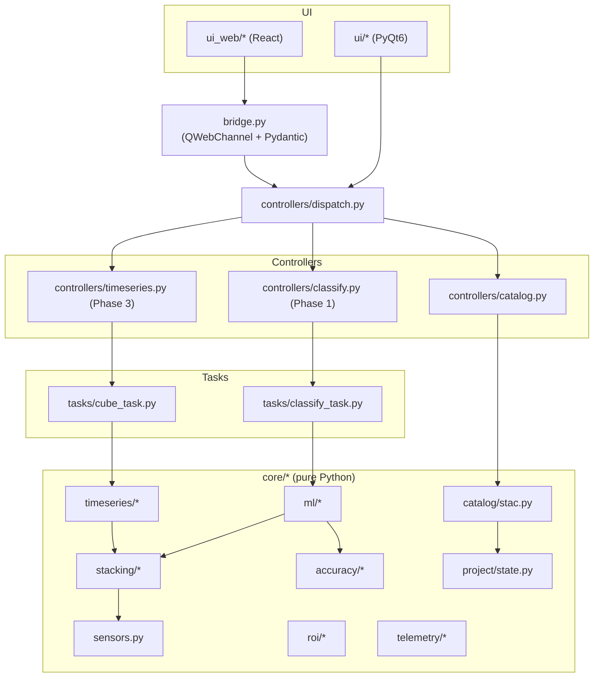

# Architecture

Terranova is structured as three hard-separated layers plus an infrastructure surface. The **domain layer** never imports from `qgis.*` or `PyQt*` — this is the rule that lets the core algorithms be tested headlessly, shipped as a standalone library in the future, and reused outside QGIS.

```
┌────────────────────────────────────────────────────────────────────┐
│  UI LAYER                                                          │
│  ┌────────────────────────────┐  ┌──────────────────────────────┐  │
│  │  Tier A: PyQt6 + qfluent   │  │ Tier B: React 18 + Tailwind  │  │
│  │  - Docks, dialogs          │◀▶│  in QWebEngineView           │  │
│  │  - Processing param forms  │  │  - Welcome, palette, charts  │  │
│  └────────────┬───────────────┘  └──────────────┬───────────────┘  │
│               │ signals/slots, QWebChannel      │                  │
│  ┌────────────▼─────────────────────────────────▼───────────────┐  │
│  │  CONTROLLER LAYER  (terranova.controllers.*)                │  │
│  │  Thin adapters: input validation, QgsTask launch, layer add  │  │
│  └────────────┬─────────────────────────────────┬───────────────┘  │
└───────────────┼─────────────────────────────────┼──────────────────┘
                │                                 │
┌───────────────▼─────────────────────────────────▼──────────────────┐
│  DOMAIN LAYER   (terranova.core.*)   pure Python, no qgis imports │
│  catalog (STAC) | stacking (xarray) | ml (sklearn/torch) |         │
│  timeseries (bfast) | project (pydantic) | accuracy                │
└────────────────────────────────────────────────────────────────────┘
                                  │
┌─────────────────────────────────▼──────────────────────────────────┐
│  INFRASTRUCTURE LAYER                                              │
│  rasterio, rioxarray, odc-stac, stackstac, pystac-client,          │
│  planetary-computer, omnicloudmask, terratorch, onnxruntime,       │
│  scikit-learn, optuna, shap, spyndex, bfast, rio-cogeo             │
└────────────────────────────────────────────────────────────────────┘
```

## Concurrency

Long-running work goes through `QgsTask.fromFunction(...)` or a `QgsTask` subclass:

1. **Controller** copies layer to a `pathlib.Path` or numpy array.
2. **Spawns** a `QgsTask`.
3. **Task** runs pure-Python domain code on a thread pool / dask scheduler.
4. **`finished` callback** (main thread) calls `QgsProject.instance().addMapLayer(...)`.

For ML inference, one warm ONNX Runtime `InferenceSession` is kept per model in a module-level singleton (`terranova.core.ml.inference.get_session`). ORT is thread-safe by design.

## Bridge

The web tier in `QWebEngineView` talks to Python via QWebChannel:

- `bridge.invoke(action, payload)` — sync request / response, JSON-encoded
- `bridge.event` — Python-to-web signal for streaming progress and notifications

Every message is validated on the Python side with Pydantic (`CommandMessage`) before reaching a controller. The dispatch table (`Controllers._register`) is the single source of truth for what the web tier can ask Python to do.

## State

Project state is a Pydantic v2 model persisted as `terranova.json` next to the `.qgz` file. It is schema-versioned (`schema_version`) so future migrations can be detected on load. Large training sets spill to SQLite (Phase 1+).

## Module dependency graph



The diagram is the dependency direction.  Note that the core layer is never on the receiving end of an arrow from a UI or controller — the rule that the domain stays pure-Python is structural, not stylistic.
